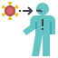

import ImageView from '~/components/ImageView.vue'

# Lets get this party started
```js script
import './components/ImageView.vue';
```



<ImageView />

> Landing page to keep a pulse of current activity and thoghts on this new norm we all line in.

### Why a pandemic?

- **Inevitable** - This is not the first time humans have faced a virus that is little understood.
- **Human reaction to loss of way of lift** - The lack of adaptability within our economic societies do not bode well for change.
- **Find the norm in the un-norm** - How to find a fulfilling path forward.


- [COVID-19 Key data points](/docs/covid-19-trends)

